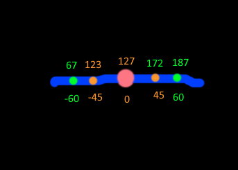

# Zeus' Enhanced Vita Snooper†

A simple homebrew for testing the input data on the PS Vita™ made on [Lua Player Plus Vita](https://github.com/Rinnegatamante/lpp-vita)

Originally created by Smoke5, converted to Lua by Keinta15

### Features:

(most of it's not my work, i just added features (in bold) that i was missing)

* highlight currently pressed buttons
* visual feedback & absolute numbers of analogue stick input
* visual feedback of touchscreen/touchpad, including multitouch
* **max range of analogue stick input (useful for adjusting deadzones)**
* stereo audio tester
* **is now a “safe” homebrew, as i saw no reason otherwise**

### Dev Miscellany:

#### Building:

lua player plus' builder is included in .\lpp - read the readme in there, or just run zbuild.bat

* i've modified build.bat to zbuild.bat because i'm lazy
	* use the original if you want to change the name/id
	* you'll have to mess with directories
* i'm not quite sure how to affect param.sfo, so i edit it manually with a hex editor
* this is how i visualise stick range

---

## Credits to:

- Original VitaTester [SMOKE5](https://github.com/SMOKE5) for [VitaTester](https://github.com/SMOKE5/VitaTester)
- Conversion to Lua [Keinta15](https://github.com/Keinta15/) for [Lua Vita Tester](https://github.com/Keinta15/Lua-Vita-Tester)

## Extra Credits

- [Rinnegatamante](https://github.com/Rinnegatamante) for [lpp-vita](https://github.com/Rinnegatamante/lpp-vita)
- [xerpi](https://github.com/xerpi) for [vita2dlib](https://github.com/xerpi/vita2dlib)
- [UrielTapia97](https://twitter.com/UrielTapia97) for the images and icons used in this homebrew
- [Ruben_Wolfe451](https://twitter.com/Ruben_Wolfe451)

---

†yes, i named it just for the acronym
